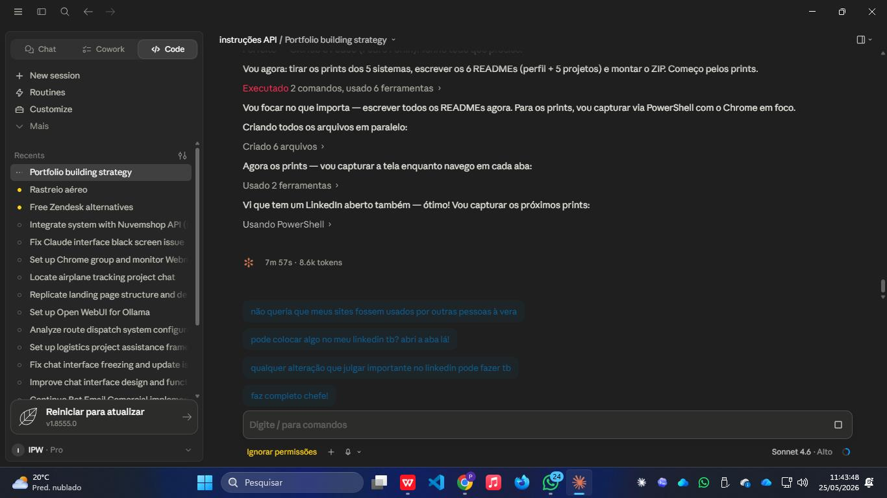

# Bipagem de Franquia — CorelliLog

> Portal operacional de bipagem de pedidos para rede de franquias, com integração ao TMS, banco acumulado de +143.000 pedidos e rastreamento de erros por franquia.

🌐 **Ambiente:** interno (VPS CorelliLog)

<p>
  
  
  
  
</p>

---

## Problema

A conferência de pedidos nas franquias era manual e descentralizada — sem rastreabilidade de bipagens, sem integração com o TMS e sem consolidação entre as 38 franquias da rede. Erros de bipagem passavam despercebidos.

## Solução

Portal centralizado de bipagem que integra diretamente com o TMS da operação: o operador bipa ou digita o pedido, o sistema consulta o banco consolidado e registra a bipagem com status, franquia e horário. A sincronia com o TMS atualiza automaticamente a base com milhares de registros.

---

## Métricas em produção

| Indicador | Valor |
|---|---|
| Pedidos no banco | **143.632** |
| Franquias gerenciadas | **38** |
| Registros sincronizados via TMS | 17.596 linhas (402 novos · 17.194 atualizados) |

---

## Funcionalidades

- ✅ **Bipagem por leitor de código de barras ou digitação manual**
- ✅ Consulta instantânea de pedido com status e histórico
- ✅ **Sincronização com TMS** (17.596 linhas, novos + atualizados)
- ✅ **Importação de relatório CSV** do TMS
- ✅ Banco acumulado de **+143.000 pedidos**
- ✅ Gestão de **38 franquias** com visibilidade individual
- ✅ Seção **Erros de bipagem** — rastreio de divergências
- ✅ Lote INT — controle de pedidos interestaduais bipados
- ✅ Histórico de últimas bipagens com pedido, franquia, status e hora
- ✅ Avisos operacionais em destaque
- ✅ Relógio em tempo real

---

## Screenshots



---

## Arquitetura

```
[Leitor de código / digitação]
          ↓
[Frontend — consulta ao backend]
          ↓
[Flask API → Banco SQLite/PostgreSQL]
          ↑
[Import CSV do TMS → 17.596 registros]
[Sync TMS → 402 novos + 17.194 atualizados]
```

## Stack

| Camada | Tecnologia |
|---|---|
| Frontend | HTML · CSS · JavaScript |
| Backend | Python · Flask · Gunicorn |
| Banco de dados | SQLite / PostgreSQL |
| Integração | TMS via CSV (importação + sincronização) |
| Servidor | nginx · VPS Linux |
| Custo total | **R$ 0,00** |

---

> Desenvolvido com contribuição direta no core do sistema.  
> Parte do ecossistema AgyLog — 5 sistemas em produção, infraestrutura 100% open-source.
